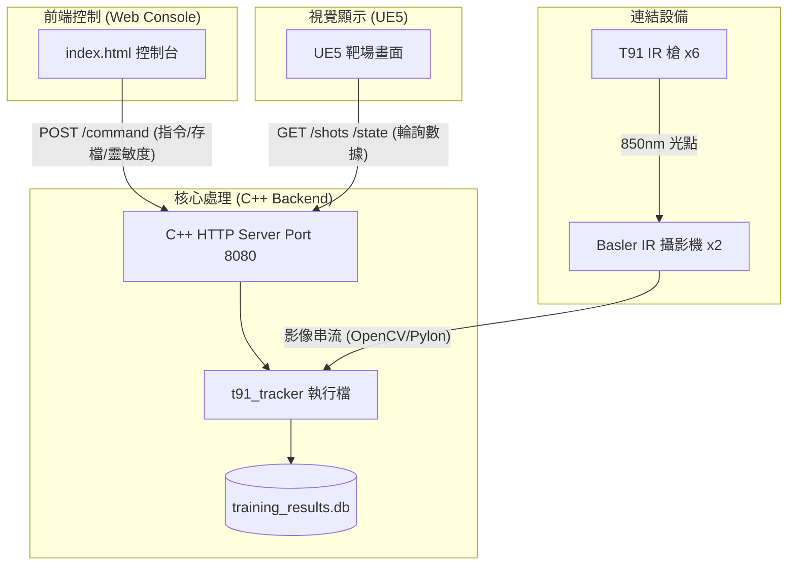

# T91 紅外線射擊訓練系統 - 完整設計文件

## 文件資訊
- 版本：2.0 (C++ 高效能版)
- 日期：2025-12-22
- 狀態：已完成 C++ 重構，提升影像處理效能與系統穩定度

---

## 一、系統總覽

### 1.1 硬體配置
| 類別 | 設備 | 規格 | 數量 |
|------|------|------|------|
| 電腦 | DELL OptiPlex Tower Plus 7020 | i7-14700 / 16GB / RTX 4060 / 512GB SSD | 1 台 |
| 投影機 | Panasonic PT-VMZ60 | 1920×1200 / 6000 流明 | 2 台 |
| IR 攝影機 | Basler acA640-90gm | 640×480 @ 90fps / IR850 / GigE | 2 台 |
| IR 槍 | T91 模擬氣動步槍 | 850nm 不可見光 IR 發射 | 6 把 |

### 1.2 系統架構圖 (3.0 - C++ Native)

---

## 二、通訊與效能優化

### 2.1 C++ 高效能架構
系統已全面由 Python 遷移至 C++，主要優化點：
- **零延遲影像處理**：直接呼叫 OpenCV C++ API，減少 Python 封裝層的開銷。
- **多執行緒併發**：影像擷取、光點偵測、與 HTTP 伺服器分別運行於不同執行緒，確保 90fps 穩定偵測。
- **記憶體管理**：優化影像緩衝區，降低長期運行的記憶體占用。

### 2.2 統一通訊介面 (Port 8080)
- **控制指令**：`/command` 接收網頁端發送的環境、模式、手動倒靶指令。
- **即時數據**：`/shots` 提供 UE5 輪詢最新的中彈座標。
- **系統狀態**：`/state` 同步目前靶位狀態與訓練參數。

---

## 三、資料庫與數據保存

### 3.1 訓練紀錄管理
- **資料庫**：SQLite 整合。
- **路徑**：`training_results.db`
- **功能**：支援梯次、連隊、班別、射手姓名及成績的結構化儲存。

---

## 四、UI/UX 介面設計 (v2.0 修正)

針對教官操作直覺性進行了佈局調整：
1.  **佈局優化**：將「手動控制」面板移至右側，解決左下角與 SOP 指令區重疊的問題。
2.  **SOP 指導**：保留大型軍事口令按鈕，支援自動化語音序列。
3.  **即時回饋**：中彈閃爍與連線狀態燈號即時顯示。

---

## 五、IR 技術實作

### 5.1 座標映射與校準
- **Homography Matrix**：採用 OpenCV `perspectiveTransform` 進行四點校準。
- **動態閾值**：支援 0-255 級靈敏度即時調整，適應不同環境光。

---

## 六、交付物清單 (C++ 版)

- [x] **Web Console**: `index.html` (佈局優化版)。
- [x] **C++ Source**: `cpp/src/`, `cpp/include/` (核心原始碼)。
- [x] **Build System**: `cpp/Makefile` (編譯腳本)。
- [x] **Executable**: `t91_tracker` (高效能執行檔)。
- [x] **Documentation**: `Complete_System_Design.md` (本文件)。

---
**文件更新完成 - 2025-12-22 (v2.0)**

